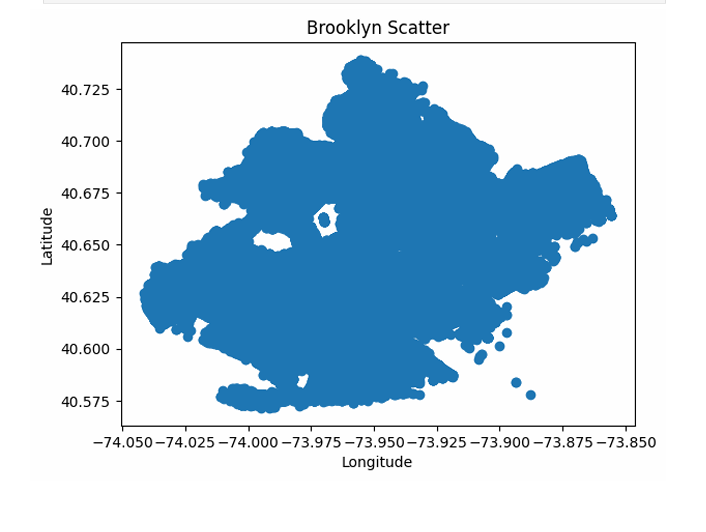
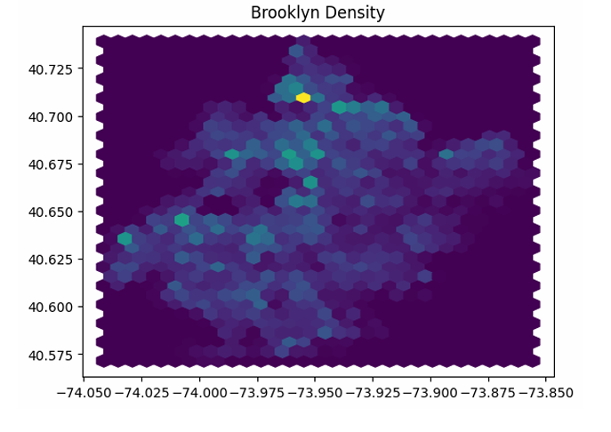
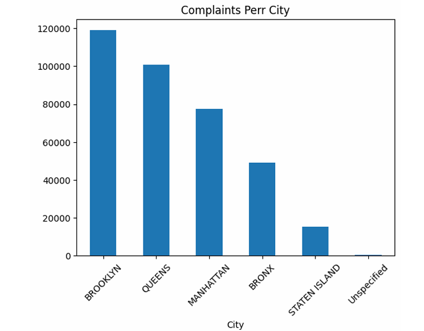
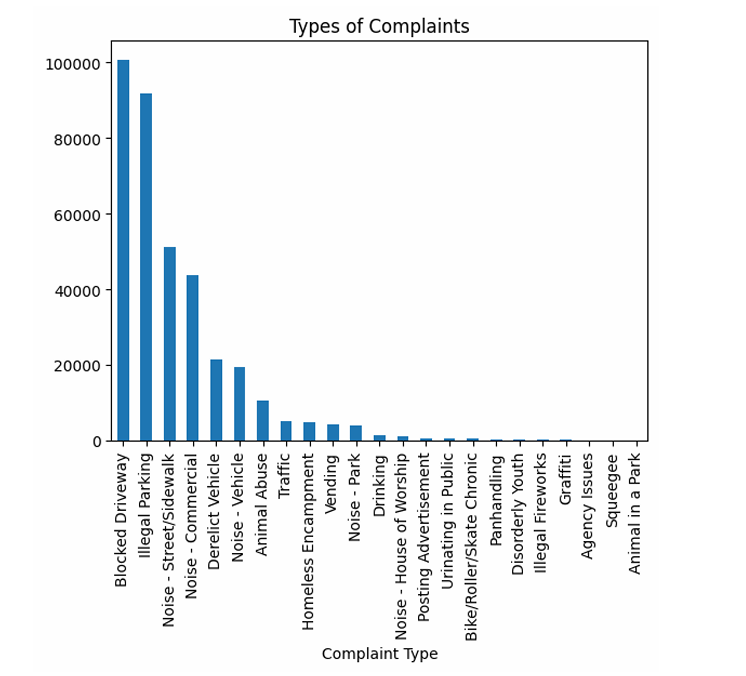

# 311 Service Request Analysis: NYC Operations

## 📌 Project Overview
This project involves a deep dive into the *NYC 311 Service Request dataset* (34,000+ records) to analyze service performance and complaint patterns. As a Data Analyst, I performed end-to-end processing—from data cleaning and time-series analysis to statistical hypothesis testing—to determine how efficiently the city handles different complaint types.

## 🛠️ Tech Stack
* *Language:* Python (Pandas, NumPy)
* *Statistical Analysis:* SciPy (Hypothesis Testing)
* *Visualization:* Matplotlib, Seaborn
* *Tools:* Jupyter Notebook

## 📂 Project Tasks & Problem Statements
Based on the project requirements, the following tasks were completed:
1.  *Data Wrangling:* Cleaned the dataset and handled missing values, focusing on key columns like Complaint Type, City, and Status.
2.  *Time-Series Analysis:* Calculated the *Request Closing Time* by finding the difference between Created Date and Closed Date.
3.  *Exploratory Data Analysis (EDA):*
    * Identified the *Top 10 Complaint Types*.
    * Visualized complaint distribution across different *Cities*.
    * Analyzed the status of requests (Open vs. Closed).
4.  *Statistical Testing:* Conducted hypothesis testing to verify if the average response time differs significantly across various complaint types.

## 🚀 Key Insights
* *Most Common Issue:* Identified the primary reason citizens contact 311 (e.g., Blocked Driveway or Illegal Parking).
* *City Performance:* Ranked cities based on their efficiency in resolving service requests.
* *Resolution Trends:* Mapped out the average time taken to close tickets, identifying bottlenecks in specific departments.

## 📊 Visualizations
* Bar charts showing the frequency of major complaint types.
* Scatter plots/Hexbin plots highlighting the geographic concentration of complaints.
* Distribution plots of the Request Closing Time.

## 📖 How to Run This Project
1.  *Clone the Repository:*
    bash
    git clone [https://github.com/Pranav-Kesarkar/NYC-311-Analysis.git](https://github.com/Pranav-Kesarkar/NYC-311-Analysis.git)
    
2.  *Install Dependencies:*
    bash
    pip install pandas numpy matplotlib seaborn scipy
    
3.  *Run the Analysis:* Open NYC_311_Analysis.ipynb in Jupyter Notebook and run all cells.

---
*Author:* Pranav Kesarkar  
*Internship:* Data Analyst Intern at Cravita Technologies  
*Connect with me:* [LinkedIn](https://www.linkedin.com/in/pranav-kesarkar)

